# Single Player Mahjong

## About Mahjong

1. Mahjong originated in the Qing Dynasty (around 1840) in China.
2. The four directions (East, South, West, North) form a complete circle of the universe.
3. Character tiles (1-9) progress from unity to longevity, representing the cosmic order.
4. The three Dragon tiles are: Red Dragon (center of the universe), Green Dragon (prosperity), and White Dragon (purity).

**In oriental philosophy, their combination embodies Harmony.**

## Project Overview

A Python-based Single Player Mahjong:

- Simplified 32-tile ruleset optimized
- Monte Carlo Tree Search (MCTS) and Q-learning for automated strategy optimization
- Dynamic Programming for minimal winning steps analysis
- A Flask-based web interface for interactive play and visualization (UI and tile images adapted from [Pomax/mahjong](https://github.com/Pomax/mahjong))
- Automatic game simulation, result saving, and performance analysis
- This is a **must-win game**: every deal is theoretically winnable with optimal play

## Game Rules
1. **Basic Rules**
   - Use 32 tiles (16 unique tiles, each appears twice)
   - Start with 8 tiles
   - Each turn: draw one tile and discard one
   - Goal: Form a winning hand with minimal steps

2. **Winning Pattern**
   - Must have exactly 8 tiles
   - Required combinations:
     * Two sequences (each: three consecutive Character tiles, e.g., 1-2-3)
     * One pair (two identical tiles)
   - Note: Only Character tiles (1-9) can form sequences

3. **Scoring System**
   - Base Score: 100 - steps (minimum 0)
   - Combination Bonus:
     * All Characters (all tiles are 1-9 Characters) +20
   - Final score = Base score + Combination bonus

## Tile Set
Each tile appears exactly twice in the game:

**Characters (Manzu, 万子):**
1 (C1)   2 (C2)   3 (C3)   4 (C4)   5 (C5)   6 (C6)   7 (C7)   8 (C8)   9 (C9)

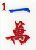 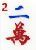 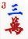 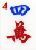 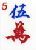 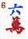 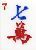 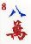 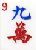

**Winds (风牌):**
East (东)   South (南)   West (西)   North (北)

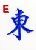 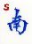 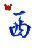 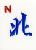

**Dragons (三元牌):**
Green (绿/发)   Red (红/中)   White (白)

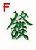 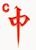 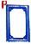

## Winning Pattern Examples
A winning hand requires two sequences (in Characters) and one pair:
- Valid sequences: Any three consecutive Characters (1-2-3, 2-3-4, ..., 7-8-9)
- Valid pairs: Any two identical tiles (Characters, Winds, or Dragons)

Example:
- Sequence 1: (1-2-3) 
   
- Sequence 2: (4-5-6)
   
- Pair: (East-East)
  

Bonus: +20 points if all tiles are Characters

## Mathematical Foundations: MDP, BE, DP & MCTS


- **Markov Decision Process (MDP)**: 
- **State:** The current state is defined by the player's hand, the remaining tiles in the wall, and, if needed, the game history for more advanced analysis.
- **Action:** At each step, the player chooses which tile to discard from their hand.
- **Transition (STEP):** After discarding a tile, the player draws a new tile from the wall, resulting in a new state.
- **Value function (Reward):** The objective is to win in the fewest possible steps and achieve the highest possible score.
No points are awarded during intermediate steps; only the final hand is scored.
When a winning hand is achieved, the score is calculated as 100 minus the number of steps taken, plus a 20-point bonus for a straight (all Character tiles). If the player cannot win or the wall is empty, the score is zero.

**Score Calculation Matrix**
| Steps Taken | Base Score (100 - Steps) | All Character Tiles Bonus | Final Score (if all Characters) |
|:-----------:|:-----------------------:|:------------------------:|:-------------------------------:|
|      0      |          100            |           +20            |             120                 |
|      1      |           99            |           +20            |             119                 |
|      2      |           98            |           +20            |             118                 |
|      5      |           95            |           +20            |             115                 |
|     10      |           90            |           +20            |             110                 |
|     20      |           80            |           +20            |             100                 |
|     50      |           50            |           +20            |              70                 |
|    100      |            0            |           +20            |              20                 |


- **Bellman Equation (BE):**
  - $V(s) = \min_a E_{s'}[1 + V(s')]$
  - $V(s)$: Expected steps to win from state $s$
  - $a$: Possible discard actions
  - $s'$: Next state after drawing a tile
- Implementation: Uses **Monte Carlo Tree Search (MCTS)** to approximate solutions through simulation
- **Dynamic Programming (DP)**: Solves Bellman equation recursively for optimal value function
- **Memoization:** Use lru_cache to avoid redundant computation


## Project Structure
- `single_player_mahjong.py`: Core game logic and AI
- `app.py`: Web server and API
- `index.html`: Web interface
- `auto_train_mcts.py`: Training script

## Core Implementation
1. **Key Functions**
   - `init_tiles()`: Initialize game with 8 random tiles
   - `is_ready()`: Check if hand is ready to win (tingpai)
   - `is_win()`: Check if hand is winning
   - `mcts_decision()`: AI decision using Monte Carlo Tree Search
   - `shanten()`: Calculate steps away from winning
   - `calc_score()`: Calculate final score

2. **AI Strategy**
   - For each possible discard:
     * Simulates thousands of games
     * Records win rate and average steps to win
   - Suggests the move with highest chance of quick win
   - Shows expected steps needed and win probability

## AI Implementation
### Monte Carlo Tree Search (MCTS)
- Real-time move suggestions through game simulation
- Win probability estimation
- Expected steps to win calculation
- Configurable simulation depth and parameters

### Dynamic Programming (DP)
- Optimal strategy analysis for game states
- Minimal steps calculation using Bellman equation
- Full state space analysis capability
- Progress tracking for long computations

### Training and Analysis
The `auto_train_mcts.py` script provides:
- Automated game simulations
- Performance metrics collection
- Strategy effectiveness analysis
- CSV export for detailed analysis 

## Setup and Run
1. Dependencies:
```bash
# Install required packages
pip3 install -r requirements.txt
```
Required packages:
- Flask: Web server framework
- Flask-Session: Session management
- Pillow: Image processing
- Python 3.6+

2. Start Server:
```bash
python3 app.py
```

3. Access Game:
- Open browser: `http://127.0.0.1:8080`
- Available routes:
  * `/`: Main game interface
  * `/api/new_game`: Start a new game
  * `/api/discard/<tile>`: Process tile discard

## Testing

### Unit Test (A)
Test the hand-winning logic (`is_win`) with a variety of hands:
```bash
python3 test/test_is_win.py
```
All test cases should show `PASS`.

### Integration Test (B)
Simulate a full single-player mahjong game with random tiles, AI decision, and scoring:
```bash
python3 test/test_integration_game.py
```
You will see the full game process and final result.

### Regression Test (C)
(Optional) Run all tests at once:
```bash
python3 test/run_all_tests.py
```
This will automatically run all test scripts.

### Adding New Tests
- To add new hand patterns for `is_win`, edit `test/test_is_win.py`.
- To test specific game flows, modify or extend `test/test_integration_game.py`.

### Notes
- All tests are self-contained and require only Python 3 and the dependencies in `requirements.txt`.
- Each time you change core logic, please rerun all tests to ensure correctness.

## AI Training and Comparison: Q-learning, Dynamic Programming, and MCTS

### Q-learning Training: Logic, Formula, and Comparison with Dynamic Programming

**What is Q-learning?**
Q-learning is a classic reinforcement learning algorithm. It allows an agent to learn the best action to take in each state by trial and error, using only feedback (rewards) from the environment—without knowing the full rules or future consequences in advance.

**Core idea:**
- The agent tries different actions in different states.
- It records the "quality" (Q-value) of each state-action pair in a table (the Q-table).
- Over time, it learns which actions lead to better long-term rewards.

**Q-learning Update Formula:**

    Q(s, a) ← Q(s, a) + α [ r + γ maxₐ' Q(s', a') - Q(s, a) ]

Where:
- Q(s, a): The current Q-value for state s and action a
- α: Learning rate
- r: Immediate reward after taking action a in state s
- γ: Discount factor
- s': The next state after taking action a
- maxₐ' Q(s', a'): The best Q-value for the next state

In our Mahjong experiments:
- The "state" is the current hand (and possibly wall).
- The "action" is which tile to discard.
- The "reward" is a combination of:
  - A large positive reward for winning (e.g., 1000 - steps)
  - A small positive reward for each step that reduces the shanten number (gets closer to winning)
  - Zero or negative reward otherwise

**What is Q-table size?**
- The Q-table size is the number of unique (state, action) pairs the agent has actually encountered and stored during training.
- A larger Q-table means the agent has explored more possible situations.
- In our experiments, Q-table size is printed after training, e.g., Q-table size: 23753.

**Dynamic Programming (DP) vs. Q-learning**

|                | Q-learning                                 | Dynamic Programming (DP)                |
|----------------|-------------------------------------------|-----------------------------------------|
| Philosophy     | Learn by trial and error, guided by reward | Systematically compute all possibilities|
| Knowledge      | No need for full model, just feedback      | Needs full knowledge of all transitions |
| Optimality     | Learns a "good enough" policy              | Finds the true optimal policy           |
| Scalability    | Handles large/unknown spaces (with enough time) | Explodes in memory/time for large spaces|
| Usage          | Good for unknown or complex environments   | Good for small, fully-known problems    |

**How did we design our experiments?**
- Q-learning: We trained a Q-learning agent on a fixed "tenpai" (one-away from win) hand, using rewards for winning and for each step closer to winning. After training, we used the Q-table to guide rollouts in MCTS, and compared the results to original MCTS (without Q-learning). We recorded the number of steps to win, total score, and Q-table size.
- Dynamic Programming: We used DP to compute the true minimal number of steps to win from the same starting hand and wall, by exhaustively searching all possible sequences of discards and draws. This gives us the "theoretical best" result for comparison.
- Original MCTS: We used Monte Carlo Tree Search to simulate many possible play sequences, choosing the move with the best average outcome. This serves as a strong baseline for comparison.

**Results: When is Q-learning better or worse?**
- Sometimes Q-learning helps: If the Q-table is well-trained (enough episodes, good reward design), it can guide MCTS to make smarter rollouts, especially in complex or less-explored situations.
- Sometimes Q-learning is worse: If the Q-table is under-trained (not enough episodes), or the reward is not well-designed, it may mislead MCTS, resulting in worse performance than pure MCTS. In small or simple scenarios, MCTS alone may already be near-optimal, so Q-learning brings little or no improvement.

**Why might Q-learning not outperform MCTS in our experiments?**
- Insufficient training: Q-learning needs many more episodes to cover the state space.
- Reward design: If the reward for intermediate steps is too small or too large, the agent may not learn the right priorities.
- State space sparsity: Many possible hands are rarely or never seen in training, so Q-values are unreliable.
- MCTS is already strong: In simple, must-win scenarios, MCTS can find the optimal path by brute-force simulation.

**Suggestions for improvement**
- Increase Q-learning training episodes (e.g., from 1,000 to 10,000+).
- Tune reward structure to better encourage progress toward winning.
- Save and reuse Q-tables to avoid retraining every time.
- Reduce exploration (epsilon) after training to make the agent more "greedy" and stable.
- Combine with other methods: Use DP for small subproblems, Q-learning for large/unknown spaces, and MCTS for real-time decision making.

**Summary Table**

| Method         | How it works         | Pros                        | Cons                        | Our Result                |
|----------------|---------------------|-----------------------------|-----------------------------|---------------------------|
| Q-learning     | Learn by reward     | Can adapt, model-free       | Needs lots of training      | Sometimes helps, sometimes not |
| DP             | Exhaustive search   | True optimal, interpretable | Not scalable to big spaces  | Theoretical best          |
| MCTS           | Simulate & select   | Strong, flexible            | Slow, needs many rollouts   | Strong baseline           |

---

## Probability of Drawing Each Hand Type in 32-Tile Mahjong

In our simplified 32-tile Mahjong (9-17 Manzu, 27-30 Winds, 31-33 Dragons, 2 copies each), the probability of drawing different 8-tile hands is as follows:

### Calculation Method
- **Total ways to draw 8 tiles:**
  \[ \text{Total} = C(32, 8) \]
- **All Manzu (Qingyise):**
  \[ \text{All Manzu} = C(18, 8) \]
- **Manzu + Wind:**
  - At least 1 Wind, rest Manzu
  - \[ \text{Manzu+Wind} = \sum_{k=1}^{8} C(8, k) \times C(18, 8-k) - C(18, 8) \]
- **Manzu + Dragon:**
  - At least 1 Dragon, rest Manzu
  - \[ \text{Manzu+Dragon} = \sum_{k=1}^{6} C(6, k) \times C(18, 8-k) - C(18, 8) \]

### Results

- **All Manzu (Qingyise):**
  - \( 43,758 / 10,518,300 \approx 0.416\% \)
- **Manzu + Wind:**
  - \( 153,153 / 10,518,300 \approx 1.456\% \)
- **Manzu + Dragon:**
  - \( 32,130 / 10,518,300 \approx 0.305\% \)

### Probability Ranking

1. **Manzu + Wind** (most likely, ~1.46%)
2. **All Manzu (Qingyise)** (~0.42%)
3. **Manzu + Dragon** (least likely, ~0.31%)

**Conclusion:**
> In the 32-tile simplified Mahjong, it is most likely to draw a hand with both Manzu and Wind, less likely to draw an all-Manzu hand, and least likely to draw a hand with both Manzu and Dragon.

---
