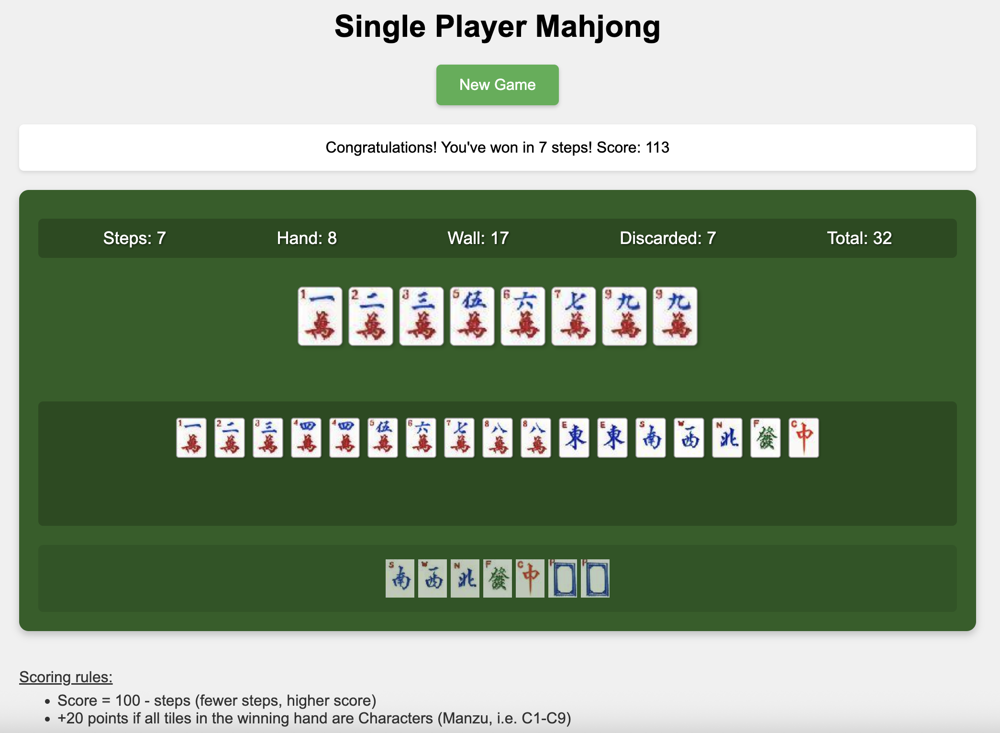
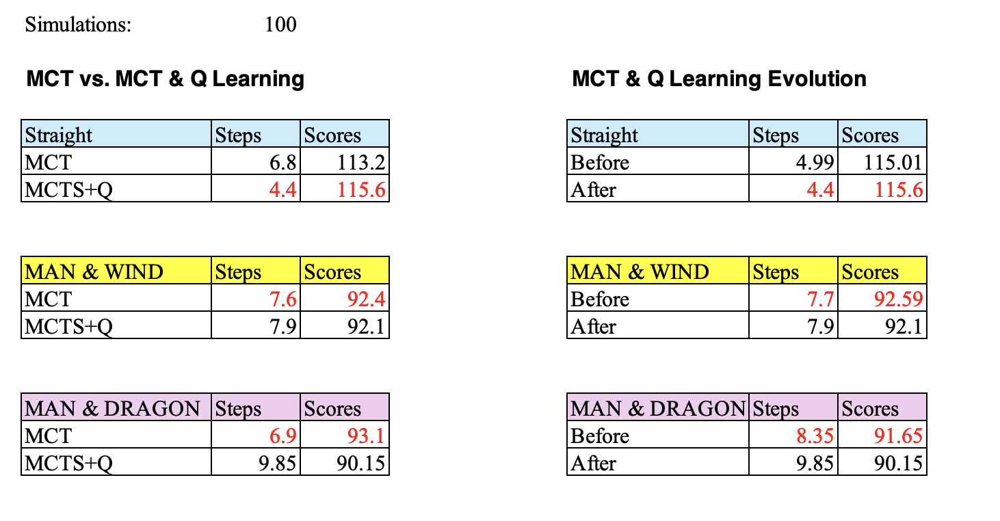

# Single Player Mahjong

## 1. Game Introduction

A Python-based Single Player Mahjong game where every deal is theoretically winnable with optimal play. The goal is to form a winning hand with minimal steps. 

### Tile Set

**Characters (Manzu, 万子):**
1 (C1)   2 (C2)   3 (C3)   4 (C4)   5 (C5)   6 (C6)   7 (C7)   8 (C8)   9 (C9)

        

**Winds (风牌):**
East (东)   South (南)   West (西)   North (北)

   

**Dragons (三元牌):**
Green (绿/发)   Red (红/中)   White (白)

  

### Winning Condition

- Must have exactly 8 tiles
- Required combinations:
  * Two sequences (Valid sequences: Any three consecutive Characters: 1-2-3, 2-3-4, ..., 7-8-9)
  * One pair (two identical tiles. Valid pairs: Any two identical tiles Characters, Winds, or Dragons)
- Only Character tiles (1-9) can form sequences


**Example Winning Hand:**
- Sequence 1: (1-2-3)  
    
- Sequence 2: (4-5-6)  
    
- Pair: (East-East)  
   

Bonus: +20 points if all tiles are Characters


## 2. MDP Structure in This Project

- **State:** The player's current hand and the remaining tiles in the wall
- **Action:** Discarding one tile from the hand
- **Transition:** After discarding, draw a new tile from the wall, forming a new state
- **Reward:** Only the final hand is scored: 100 minus the number of steps taken, plus a 20-point bonus for all-Character hands. No intermediate rewards.

## 3. Q-learning vs MCTS Results & Project Evolution

### Project Evolution
- **Initial Stage:** Used Dynamic Programming (DP) for theoretical optimal solutions, but was limited by computational complexity
- **Current Focus:** MCTS and Q-learning comparison for practical, scalable solutions
- **Conclusion:** Shifted from "theoretical optimality" to "practical feasibility" and reinforcement learning methods

### Q-learning vs MCTS Results (Summary)
- In simple hands (e.g., all Characters), both MCTS and Q-learning achieve near-optimal results
- In complex hands (with Winds/Dragons), MCTS often outperforms Q-learning unless Q-learning is extensively trained
- Q-learning converges rapidly for simple walls, but needs much more training for complex walls
- See Appendix for detailed tables and analysis

## 4. Setup and Run

1. **Install dependencies:**
```bash
pip3 install -r requirements.txt
```

2. **Start the web server:**
```bash
python3 app.py
```

3. **Run experiments:**
- MCTS vs Q-learning comparison:
  ```bash
  python3 src/backend/mcts_q_compare.py
  ```
- Single hand Q-learning training and evaluation:
  ```bash
  python3 src/backend/q_learning_single_hand_eval.py
  ```

4. **Run tests:**
- Unit test:
  ```bash
  python3 test/test_is_win.py
  ```
- Integration test:
  ```bash
  python3 test/test_integration_game.py
  ```
- MCTS test:
  ```bash
  python3 test/test_mcts.py
  ```

## 5. Requirements
- Python 3.6+
- Flask
- Flask-Session
- Pillow

---

# Appendix

## Detailed Game Rules, Tile Set, and Scoring

## About Mahjong

1. Mahjong originated in the Qing Dynasty (around 1840) in China.
2. The four directions (East, South, West, North) form a complete circle of the universe.
3. Character tiles (1-9) progress from unity to longevity, representing the cosmic order.
4. The three Dragon tiles are: Red Dragon (center of the universe), Green Dragon (prosperity), and White Dragon (purity).

**In oriental philosophy, their combination embodies Harmony.**

## Project Overview

A Python-based Single Player Mahjong:

- Simplified 32-tile ruleset optimized
- Three decision optimization methods: Monte Carlo Tree Search (MCTS), Q-learning (tabular reinforcement learning) for automated strategy optimization, and Dynamic Programming (DP) for minimal winning steps analysis
- Automated game simulation, result logging, and performance analysis 
- A Flask-based web interface for interactive play and visualization (UI and tile images adapted from [Pomax/mahjong](https://github.com/Pomax/mahjong))
- Automatic game simulation, result saving, and performance analysis
- This is a **must-win game**: every deal is theoretically winnable with optimal play

## Game Rules
1. **Basic Rules**
   - Use 32 tiles (16 unique tiles, each appears twice)
   - Start with 8 tiles
   - Each turn: draw one tile and discard one
   - Goal: Form a winning hand with minimal steps

2. **Winning Pattern**
   - Must have exactly 8 tiles
   - Required combinations:
     * Two sequences (each: three consecutive Character tiles, e.g., 1-2-3)
     * One pair (two identical tiles)
   - Note: Only Character tiles (1-9) can form sequences

3. **Scoring System**
   - Base Score: 100 - steps (minimum 0)
   - Combination Bonus:
     * All Characters (all tiles are 1-9 Characters) +20
   - Final score = Base score + Combination bonus


**Score Calculation Matrix**
| Steps Taken | Base Score (100 - Steps) | All Character Tiles Bonus | Final Score (if all Characters) |
|:-----------:|:-----------------------:|:------------------------:|:-------------------------------:|
|      0      |          100            |           +20            |             120                 |
|      1      |           99            |           +20            |             119                 |
|      2      |           98            |           +20            |             118                 |
|      5      |           95            |           +20            |             115                 |
|     10      |           90            |           +20            |             110                 |
|     20      |           80            |           +20            |             100                 |
|     50      |           50            |           +20            |              70                 |
|    100      |            0            |           +20            |              20                 |


## Web Interface Example




## Mathematical Foundations: MDP, BE, DP, MCTS & Q-learning

- **Markov Decision Process (MDP)**: 
- **State:** The current state is defined by the player's hand, the remaining tiles in the wall, and, if needed, the game history for more advanced analysis.
- **Action:** At each step, the player chooses which tile to discard from their hand.
- **Transition (STEP):** After discarding a tile, the player draws a new tile from the wall, resulting in a new state.
- **Value function (Reward):** The objective is to win in the fewest possible steps and achieve the highest possible score.
No points are awarded during intermediate steps; only the final hand is scored.
When a winning hand is achieved, the score is calculated as 100 minus the number of steps taken, plus a 20-point bonus for a straight (all Character tiles). If the player cannot win or the wall is empty, the score is zero.


- **Bellman Equation (BE):**
  - $V(s) = \min_a E_{s'}[1 + V(s')]$
  - $V(s)$: Expected steps to win from state $s$
  - $a$: Possible discard actions
  - $s'$: Next state after drawing a tile
- Implementation: Uses **Monte Carlo Tree Search (MCTS)** to approximate solutions through simulation
- **Dynamic Programming (DP)**: Solves Bellman equation recursively for optimal value function
- **Memoization:** Use lru_cache to avoid redundant computation

**Q-learning (Reinforcement Learning Foundation):**
Q-learning is a classic reinforcement learning algorithm. It allows an agent to learn the best action to take in each state by trial and error, using only feedback (rewards) from the environment—without knowing the full rules or future consequences in advance.

**Core idea:**
- The agent tries different actions in different states.
- It records the "quality" (Q-value) of each state-action pair in a table (the Q-table).
- Over time, it learns which actions lead to better long-term rewards.

**Q-learning Update Formula:**
```
Q(s, a) ← Q(s, a) + α [ r + γ maxₐ' Q(s', a') - Q(s, a) ]
```
Where:
- Q(s, a): The current Q-value for state s and action a
- α: Learning rate
- r: Immediate reward after taking action a in state s
- γ: Discount factor
- s': The next state after taking action a
- maxₐ' Q(s', a'): The best Q-value for the next state

**What is Q-table size?**
- The Q-table size is the number of unique (state, action) pairs the agent has actually encountered and stored during training.
- A larger Q-table means the agent has explored more possible situations.
- In our experiments, Q-table size is printed after training, e.g., Q-table size: 23753.


## Project Structure
- `app.py`: Web server and API (main entry point)
- `single_player_mahjong.py`: Core game logic and AI
- `mcts_q_compare.py`: MCTS vs Q-learning comparison experiments
- `q_learning_single_hand_eval.py`: Single hand Q-learning training and evaluation
- `q_learning.py`: Q-learning agent implementation (used by other scripts)
- `index.html`: Web interface

## Implementation Details

### Key Functions
- `init_tiles()`: Initialize game with 8 random tiles
- `is_ready()`: Check if hand is ready to win (tenpai)
- `is_win()`: Check if hand is winning
- `mcts_decision()`: AI decision using Monte Carlo Tree Search
- `shanten()`: Calculate steps away from winning
- `calc_score()`: Calculate final score

### Decision Flow
- For each possible discard:
  - Simulates thousands of games (MCTS)
  - Records win rate and average steps to win
  - Suggests the move with highest chance of quick win
  - Shows expected steps needed and win probability

### Training and Analysis Scripts
- `mcts_q_compare.py`: Batch simulation and comparison between MCTS and Q-learning
- `q_learning_single_hand_eval.py`: Single hand Q-learning training and evaluation
- `analyze_mcts_results.py`: (Optional, lower priority) Post-processing and visualization of MCTS and Q-learning comparison results. Reads experiment CSVs and generates summary statistics or plots.
- `analyze_mcts_simulation.py`: (Optional, lower priority) Post-processing and visualization of pure MCTS simulation results.

## Full Experimental Results and Tables

### Core Methods
- **MCTS:** Monte Carlo Tree Search simulates thousands of games per move to select the discard with the best expected outcome.
- **Q-learning:** A tabular reinforcement learning algorithm that learns optimal discard strategies through experience. Can be used to guide MCTS rollouts for improved efficiency.
- **DP:** Dynamic Programming computes the theoretical minimum steps to win from any state using the Bellman equation.

### Experimental Design and Results

|                | Q-learning                                 | Dynamic Programming (DP)                |
|----------------|-------------------------------------------|-----------------------------------------|
| Philosophy     | Learn by trial and error, guided by reward | Systematically compute all possibilities|
| Knowledge      | No need for full model, just feedback      | Needs full knowledge of all transitions |
| Optimality     | Learns a "good enough" policy              | Finds the true optimal policy           |
| Scalability    | Handles large/unknown spaces (with enough time) | Explodes in memory/time for large spaces|
| Usage          | Good for unknown or complex environments   | Good for small, fully-known problems    |


**How did we design our experiments?**
- Q-learning: We trained a Q-learning agent on a fixed "tenpai" (one-away from win) hand, using rewards for winning and for each step closer to winning. After training, we used the Q-table to guide rollouts in MCTS, and compared the results to original MCTS (without Q-learning). We recorded the number of steps to win, total score, and Q-table size.
- Dynamic Programming: We used DP to compute the true minimal number of steps to win from the same starting hand and wall, by exhaustively searching all possible sequences of discards and draws. This gives us the "theoretical best" result for comparison.
- Original MCTS: We used Monte Carlo Tree Search to simulate many possible play sequences, choosing the move with the best average outcome. This serves as a strong baseline for comparison.

**Results: When is Q-learning better or worse?**
- Sometimes Q-learning helps: If the Q-table is well-trained (enough episodes, good reward design), it can guide MCTS to make smarter rollouts, especially in complex or less-explored situations.
- Sometimes Q-learning is worse: If the Q-table is under-trained (not enough episodes), or the reward is not well-designed, it may mislead MCTS, resulting in worse performance than pure MCTS. In small or simple scenarios, MCTS alone may already be near-optimal, so Q-learning brings little or no improvement.

**MCTS & Q-learning Experiment Results**




**Why might Q-learning not outperform MCTS in our experiments?**
- Insufficient training: Q-learning needs many more episodes to cover the state space.
- Reward design: If the reward for intermediate steps is too small or too large, the agent may not learn the right priorities.
- State space sparsity: Many possible hands are rarely or never seen in training, so Q-values are unreliable.
- MCTS is already strong: In simple, must-win scenarios, MCTS can find the optimal path by brute-force simulation.

**Suggestions for improvement**
- Increase Q-learning training episodes (e.g.10,000+).
- Tune reward structure to better encourage progress toward winning.
- Save and reuse Q-tables to avoid retraining every time.
- Reduce exploration (epsilon) after training to make the agent more "greedy" and stable.
- Combine with other methods: Use DP for small subproblems, Q-learning for large/unknown spaces, and MCTS for real-time decision making.


**Summary Table**

| Method         | How it works         | Pros                        | Cons                        | Our Result                |
|----------------|---------------------|-----------------------------|-----------------------------|---------------------------|
| Q-learning     | Learn by reward     | Can adapt, model-free       | Needs lots of training      | Sometimes helps, sometimes not |
| DP             | Exhaustive search   | True optimal, interpretable | Not scalable to big spaces  | Theoretical best          |
| MCTS           | Simulate & select   | Strong, flexible            | Slow, needs many rollouts   | Strong baseline           |


### About the Single Hand Experiment

In our Q-learning experiments, we focus on a **fixed single hand** scenario to analyze the agent's learning progress in a controlled setting.

- **Initial Hand:**  
           
  This corresponds to the tiles **1-8 of Characters (Manzu, 万子)**. In Mahjong notation, these are the tiles C1, C2, C3, C4, C5, C6, C7, C8.

- **Wall Tiles:**  
  The wall consists of the remaining Character tiles (1-9, each with two copies), minus those already in the hand.  
  For this experiment, the wall contains **10 tiles**:  
  All Character tiles from 1 to 9 (with two copies each), except for the ones already in the initial hand.

- **Goal:**  
  The agent must draw and discard tiles to form a winning hand (two sequences and one pair) in as few steps as possible, maximizing the final score.

This setup allows us to measure the Q-learning agent's ability to learn optimal play for a specific, challenging hand configuration.


### Q-learning Single Hand Training Results (Summary Table)

| Wall Tiles         | Training Episodes | Evaluation Runs | Avg Steps to Win | Best Steps | Avg Total Score | Best Total Score | Q-table Entries | Q-value Min | Q-value Max | Q-value Mean |
|--------------------|------------------|-----------------|------------------|------------|-----------------|------------------|-----------------|-------------|-------------|--------------|
| Manzu (10 tiles)   | 10,000           | 1,000           | 3.39             | 1          | 116.61          | 119              | 45,071          | -9.9991     | 8.0689      | -0.1413      |
| Manzu (10 tiles)   | 100,000          | 5,000           | 3.93             | 1          | 116.07          | 119              | 62,109          | -10         | 10          | -0.4168      |
| Manzu+Winds/Drag.  | 1,000            | 5,000           | 3.59             | 1          | 113.87          | 119              | 129,279         | -10         | 10          | -0.3454      |
| Manzu+Winds/Drag.  | 10,000           | 5,000           | 3.24             | 1          | 113.87          | 119              | 77,466          | -10         | 10          | -0.5551      |
| Manzu+Winds/Drag.  | 100,000          | 5,000           | 3.28             | 1          | 111.91          | 119              | 326,836         | -10         | 10          | -0.1549      |
| All (24 tiles)     | 1,000            | 5,000           | 7.99             | 1          | 100.23          | 119              | 2,863,336       | -10         | 10          | -0.0922      |
| All (24 tiles)     | 10,000           | 5,000           | 1.77             | 1          | 115.96          | 119              | 4,319,214       | -10         | 10          | -0.2463      |
| All (24 tiles)     | 100,000          | 5,000           | 1.86             | 1          | 115.84          | 119              | 4,319,214       | -10         | 10          | -0.2463      |
| All (24 tiles)     | 1,000,000        | 5,000           | 1.73             | 1          | 115.63          | 119              | 4,319,214       | -1.1355     | -1          | -1.0321      |

**Note:** The "Wall Tiles" column shows the types of tiles included in the wall for each experiment. For example, "Manzu" means only Character tiles; "All" means Characters, Winds, and Dragons are all included.

- **Initial hand:** [9, 10, 11, 12, 13, 14, 15, 16] (1-8 Manzu)
- **Best Steps:** Minimum steps to win observed in this experiment (theoretical best is 1, and was achieved in all cases)
- **Best Total Score:** Maximum total score observed in this experiment (theoretical best is 119, and was achieved in all cases)
- **Evaluation runs:** See table
- **Agent:** Q-learning, feature-based state, persistent Q-table

#### Observations
- In all experiments, Q-learning was able to achieve the theoretical best steps and score in some evaluation runs, and the average performance approaches the optimum as training episodes increase.
- Q-table size and training time increase with wall complexity, but performance converges with sufficient training.
- Feature-based state representation enables efficient generalization and learning.

**Interpretation:**  
The agent converges rapidly for simple walls, and with enough training, can handle complex walls (with Winds/Dragons) nearly as efficiently. Most improvement happens in the first 10,000–50,000 episodes. Further training brings only marginal gains, indicating convergence.


