# Two-Player Mahjong Decision System Design Document

## 1. Project Overview

### 1.1 Project Goals
- Implement a simplified two-player Mahjong decision system based on MDP (Markov Decision Process)
- Support open-hand gameplay (both players' hands are visible)
- Optimize tile selection and action decisions using state value estimation
- Support human vs computer gameplay

## 2. Two-Player Mahjong Game Rules

### 2.1 Tile Notation

#### Characters (Manzu, 万)
- Notation: 1-9 with 'C' suffix (e.g., 1C, 2C)
- Complete set (1-9):
  
          

#### Honors
- Winds:
  - East (东): 
  - South (南): 
  - West (西): 
  - North (北): 
- Dragons:
  - White Dragon (白板): 
  - Red Dragon (红中): 
  - Green Dragon (发财): 

### 2.2 Tile Combinations

- **Pair:** Consists of 2 identical tiles, for example:
  
   

- **Sequence (Chow):** Consists of 3 consecutive numbered tiles (Characters only), for example:
  
    

- **Triplet (Pung):** Consists of 3 identical tiles, for example:
  
    

- **Kong:** Consists of 4 identical tiles, for example:
  
     

### 2.3 Simplified Rules
1. **Tile Set**
   - Characters (Manzu, 万): 1-9, 4 copies each (36 tiles)
   - Winds: East, South, West, North, 4 copies each (16 tiles)
   - Dragons: Red, Green, White, 4 copies each (12 tiles)
   - **Total: 64 tiles**

2. **Initial Setup**
   - Two players
   - Each player is dealt 13 tiles (26 tiles in total)
   - The remaining 38 tiles form the wall (draw pile). All tiles in the wall are face-down (hidden) until drawn.
   - All hands are open (fully visible to both players)

3. **Game Flow**
   - Players take turns drawing and discarding tiles
   - When an opponent discards, you can:
     * Chow (吃): Form a sequence 
     * Pung (碰): Form a triplet 
     * Win (if your hand is complete)

4. **Winning Hands and Points System**
   **Scoring System Overview:**
   - Base points: Basic score for completing a valid hand
   - Bonus points: Additional points for special patterns or conditions
   - Total points: Sum of base points and all applicable bonuses

   - Standard winning hand (14 tiles):
     * 4 sets + 1 pair
     * Example:     
     * Points: Standard Hand(20) + Concealed Triplet(5) + Self-drawn(10) = 35 points
   - Seven pairs (14 tiles):
     * Example:       
     * Points: Seven Pairs(30) + All Characters(20) + Concealed Hand(10) = 60 points
   - Note: Sequences (Chow) only allowed for Characters (1-9)

   **Points System:**
   | Type | Points | Description | Example |
   |------|--------|-------------|---------|
   | **Basic Winning Hands** |
   | Standard Hand | 20 | 4 sets + 1 pair |      |
   | Seven Pairs | 30 | 7 pairs of tiles |        |
   | **Suit Bonus** |
   | All Characters | 20 | All tiles are Characters (any combination) |    ... |
   | All Honors | 40 | All tiles are Winds/Dragons | All Winds + Dragons |
   | **Pattern Bonus** |
   | All Triplets | 30 | Four triplets + one pair | Four Pungs + pair |
   | Pure Straight | 20 | 123-456-789 |    |
   | Terminal Sets | 10 | 123-789 same suit |   |
   | **Additional Bonus** |
   | Concealed Hand | 10 | No melded sets | All self-drawn tiles |
   | Self-drawn Win | 10 | Win by self-draw | - |
   | Concealed Triplet | 5 each | Non-melded triplet | Three identical tiles drawn |
   | Dragon Triplet | 10 each | White/Red/Green Dragon triplet |  |
   | Wind Triplet | 5 each | ESWN Wind triplet |  |

## 3. Decision System Design

### 3.1 Methodology: MDP and Bellman Equation

The core challenge of two-player Mahjong decisions is to select optimal actions at each decision point based on the current state. This section introduces the Markov Decision Process (MDP) framework, which includes:
- Problem formulation: States (S), Actions (A), Transition probabilities (P), Rewards (R), Discount factor (γ)
- Bellman optimality equation for finding optimal solutions
- Optimal policy derivation based on value functions

The relationship between these concepts is crucial:
- MDP provides the mathematical framework for modeling sequential decision-making problems
- Bellman equations offer the mathematical tools for solving MDPs
- While MDP defines the problem structure (states, actions, rewards)
- Transition probabilities describe how actions lead to new states
- Bellman equation helps find the optimal value function and policy

#### 3.1.1 MDP Framework
A Markov Decision Process (MDP) is formally defined as a tuple (S, A, P, R, γ). 
A tuple in mathematics is an ordered collection of elements, similar to a list where the order matters. 

In this case, these five elements together form the complete mathematical description of a decision-making problem:
- S: Set of states
- A: Set of actions
- P: S × A × S → [0,1] is the transition probability function
  * P(s'|s,a) is probability of reaching state s' from state s taking action a
- R: S × A × S → ℝ is the reward function
  * R(s,a,s') is immediate reward for transition (s,a,s')
- γ ∈ [0,1] is the discount factor

In the context of Mahjong, these elements correspond to:
1. **Observation (State)**:
   - Current hand tiles [t1, t2, ..., tn]
   - Visible discards and exposed melds
   - Opponent's hand (in this open-hand variant)
   - Game progress (remaining tiles, wall count)
   
   Key concept: **Markov Property**
   - Next state depends only on current state and action, independent of history
   - Example: Current hand + visible tiles contain all information needed for decision making
   
2. **Action**:
   - Discard: Choose 1 tile from hand (13-14 options)
   - Meld: Form Chow (sequence) or Pung (triplet)
   - Win: Declare win with valid hand
   
   Each action is evaluated based on:
   - Immediate effect on hand composition
   - Future possibilities it creates/destroys
   - Opponent's potential responses

3. **Reward**:
   AI evaluates each move based on potential scoring opportunities:

   1. **Immediate Rewards** (Based on Points System):
      * Forming a triplet (刻子): +5 (partial progress towards Standard Hand 20 points)
      * Forming a sequence (顺子): +5 (partial progress towards Standard Hand 20 points)
      * Forming a pair (对子): +3 (needed for both Standard Hand and Seven Pairs)
      * Breaking a potential set: -5 (to avoid losing progress)

   2. **Pattern Progress Rewards**:
      * Progress towards All Characters: +5 (keeping only Character tiles)
      * Progress towards Seven Pairs: +5 (keeping potential pairs)
      * Progress towards Pure Straight: +5 (keeping 123, 456, or 789 combinations)
      * Progress towards All Triplets: +5 (prioritizing triplet formations)

   3. **Final Rewards**:
      * Winning hand: Points from scoring table (e.g., Standard Hand 20 + All Characters 20 + Self-drawn 10 = 50)
      * Losing: -20

   **Example Scenario**:
   Starting hand:   

   AI Decision Process:
   1. Keeps 1C triplet: +5 (triplet progress) +5 (All Characters progress)
   2. Keeps 234C sequence: +5 (sequence progress) +5 (All Characters progress)
   3. Draws 5C to keep: +5 (All Characters progress)
   
   If wins with a Standard Hand (all Characters):
   * Final Score: Standard Hand (20) + All Characters (20) = 40 points
   * The intermediate rewards guided AI towards this high-scoring hand

   Key concept: **Reward-Score Alignment**
   - Rewards during play reflect progress towards scoring hands
   - Final scoring follows the Points System table exactly
   - AI's decisions are guided towards achieving maximum final score

4. **Step (State Transition)**:
   How actions change the game state:
   - After Discard: s → s' = (hand - discarded_tile, opponent_draw)
   - After Pung: s → s' = (hand + 3 identical_tiles - discard)
   - After Chow: s → s' = (hand + 3 consecutive_tiles - discard)
   
   Key concept: **State Transition Properties**
   - Each action leads to state transitions with certain probabilities
   - Example: After discarding a tile, the next drawn tile is random
   - Transition probability P(s'|s,a):
     * Based on visible tiles and remaining count
     * Considers opponent's possible actions
     * Deterministic in this open-hand variant
   
   Each step results in:
   - New observations becoming available
   - Rewards being received
   - Game state moving forward based on chosen actions

#### 3.1.2 State Value Calculation

The Bellman equation is the core tool for solving MDP problems. It expresses a key idea: the value of a state under optimal policy can be calculated recursively.

1. **Core Concept**:
   - State value = Immediate reward + Discounted sum of future values
   - Using recursion to break down long-term decisions into a series of single-step decisions

2. **Mathematical Expression**:
   V(s) = max_a[R(s,a) + γ * Σ P(s'|s,a)V(s')]
   where:
   - V(s): Value of state s
   - R(s,a): Immediate reward for action a
   - γ: Discount factor (0 < γ < 1)
     * Controls the balance between immediate and future rewards
     * Lower γ (e.g., 0.6-0.7): Emphasizes immediate rewards, suitable for fast-paced games
     * Higher γ (e.g., 0.8-0.9): Values future rewards more, better for strategic planning
     * In Mahjong: Typically 0.85-0.9 to balance short-term gains (completing sets) with long-term strategy
   - P(s'|s,a): State transition probability
   - V(s'): Value of next state
   
   In Mahjong context:
   - State s: Current hand [1C,1C,1C,2C,3C,4C,5C]
   - Action a: Discard 5C
   - R(s,a): Immediate reward
     * +3 for keeping the 1C triplet
     * +2 for the potential 2C,3C,4C sequence
     * -1 for breaking connection with 5C
   - P(s'|s,a): Probability of next states
     * Based on remaining tiles in wall
     * Considers opponent's possible actions
   - γ: Discount factor (e.g., 0.9)
     * Earlier completed sets worth more
     * Balances immediate vs future gains

3. **Optimal Value Function**:
   The optimal value function V*(s) satisfies the Bellman optimality equation:
   
   V*(s) = max<sub>a∈A</sub>[R(s,a) + γΣ<sub>s'∈S</sub>P(s'|s,a)V*(s')]

   This equation forms the basis for finding the optimal policy π*(s).
   
   Example optimal decision process:
   1. Current hand: 
   2. Possible actions and their values:
      - Keep sequence potential ():
        * Sequence progress: +5
        * All Characters progress: +5
        * Future potential (γ=0.9): +4.5
        * V₁ = 14.5

      - Keep triplet ():
        * Triplet progress: +5
        * All Characters progress: +5
        * Future potential (γ=0.9): +4.5
        * V₂ = 14.5

   3. In this case V₁ = V₂, so both actions are equally optimal
      - Option 1: Discard , targeting potential Pure Straight (20 points)
      - Option 2: Discard , targeting All Triplets (30 points)

   4. Final scoring potential:
      - Pure Straight path:
        * Standard Hand: 20
        * Pure Straight: 20
        * All Characters: 20
        * Total potential: 60 points

      - All Triplets path:
        * Standard Hand: 20
        * All Triplets: 30
        * All Characters: 20
        * Total potential: 70 points

4. **Practical Implementation**:
   - Initialize value estimates for all states
   - Iteratively update values using Bellman equation
   - Example iteration:
     ```python
     # Value iteration for a specific hand state
     def update_value(hand_state):
         max_value = float('-inf')
         for action in possible_actions(hand_state):
             immediate_reward = calculate_reward(hand_state, action)
             future_value = sum(
                 prob * stored_values[next_state]
                 for next_state, prob in get_next_states(hand_state, action)
             )
             value = immediate_reward + GAMMA * future_value
             max_value = max(max_value, value)
         return max_value
     ```

5. **Application in Mahjong Strategy**:
   - Evaluate the value of each tile discard option
   - Balance immediate gains (e.g., forming a sequence) vs long-term benefits (e.g., ready hand opportunity)
   - Find optimal discard strategy through iterative calculation
   - Short-term vs Long-term trade-offs:
     * Keeping a triplet (immediate guaranteed value)
     * Building towards a sequence (potential future value)
   - Risk consideration:
     * Safe discards vs Offensive plays
     * Probability of completing sets
   - Position-based adjustments:
     * Leading: Conservative value estimates
     * Behind: Aggressive value estimates

#### 3.1.3 Reward Function Details

R(s,a,s') = Immediate_Value + Potential_Value
where:
- **Immediate_Value**:
  * Complete set (sequence/triplet): +3
  * Partial set progress: +1
  * Breaking existing set: -2
  * Ready hand formation: +5
- **Potential_Value**:
  * Tile efficiency (flexibility for future sets): 0-3
  * Distance to ready hand: -5 to +5
  * Safety consideration (avoid dangerous discards): -2 to +2

#### 3.1.4 Strategy Optimization Methods

1. **Value-based Selection**:
   - Choose actions that maximize expected value
   - Consider both immediate and future rewards
   - Update values based on actual outcomes

2. **Balance Considerations**:
   - Exploration vs exploitation
     * Early game: Higher exploration rate
     * Late game: Focus on exploitation
   - Risk vs reward
     * Leading: Conservative play
     * Behind: Aggressive strategy
   - Offensive vs defensive
     * Hand building speed
     * Defensive tile selection

3. **Learning Parameters**:
   - Initial exploration rate: 0.3
   - Exploration decay: 0.995 per round
   - Minimum exploration rate: 0.05
   - Learning rate: 0.1
   - Value update weight: 0.7

### 3.2 Implementation Details

#### 3.2.1 Observation Space
- **Hand State**: [t1, t2, ..., tn] where ti represents each tile
- **Visible Information**: 
  * Discarded tiles by all players
  * Exposed melds (Chow/Pung)
- **Game Progress**: 
  * Remaining tile count
  * Current round/wind

#### 3.2.2 Action Space
- **Discard Actions**: Choose one tile to discard
- **Meld Actions**:
  * Chow (吃): Form a sequence of three consecutive tiles
  * Pung (碰): Form a triplet of identical tiles
- **Special Actions**:
  * Declare win
  * Skip (Pass on opponent's discard)

#### 3.2.3 Transition Function

The relationship between these concepts is crucial:
- MDP provides the mathematical framework for modeling sequential decision-making problems
- Bellman equations offer the mathematical tools for solving MDPs
- While MDP defines the problem structure (states, actions, rewards)
- Transition probabilities describe how actions lead to new states
- Bellman equation helps find the optimal value function and policy

## 4. System Flow Diagrams

### 4.1 Basic Game Flow
```
[Game Start] -> [Deal] -> [Turn Start] -> [AI/Player Action] -> [Discard] -> [Win Check] -> [Turn End]
                                         ^                                                    |
                                         |____________________________________________________|
```

### 4.2 AI Decision Flow
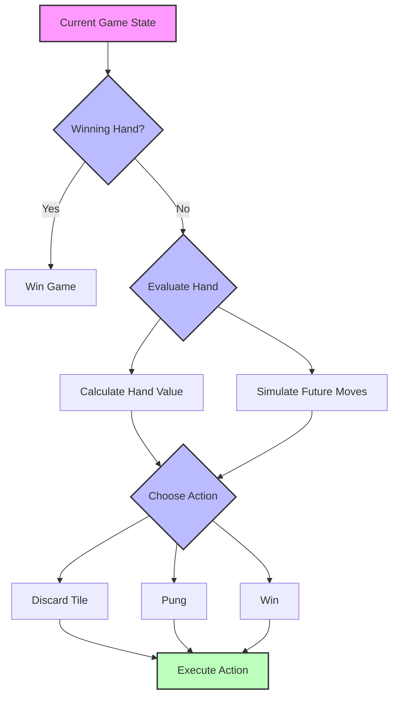

<details>
<summary style="font-size: 1.5em"><strong>5. Future Steps</strong></summary>

### 5.1 Four-Player Mahjong
- Implement full four-player gameplay
- Add concealed tiles
- Support all meld types (Chow, Pung, Kong)
- Implement complex scoring system

### 5.2 Advanced AI Features
- Implement MDP-based decision making
- Add learning capabilities
- Support multiple AI difficulty levels
- Add tournament mode

### 5.3 Additional Features
- Online multiplayer support
- Tournament system
- Statistics and analytics
- Custom rule support

## Appendix A: Full Mahjong Rules and Theory

### A.1 Theoretical Foundation

#### A.1.1 MDP (Markov Decision Process)
A Markov Decision Process is formally defined as a tuple (S, A, P, R, γ) where:
- S: Set of states
- A: Set of actions
- P: S × A × S → [0,1] is the transition probability function
  * P(s'|s,a) is probability of reaching state s' from state s taking action a
- R: S × A × S → ℝ is the reward function
  * R(s,a,s') is immediate reward for transition (s,a,s')
- γ ∈ [0,1] is the discount factor

The goal is to find a policy π: S → A that maximizes the expected discounted reward:

V<sup>π</sup>(s) = E<sub>π</sub>[Σ<sub>t=0</sub><sup>∞</sup> γ<sup>t</sup>R(s<sub>t</sub>,π(s<sub>t</sub>),s<sub>t+1</sub>)]

The optimal value function satisfies the Bellman optimality equation:

V*(s) = max<sub>a∈A</sub>[R(s,a) + γΣ<sub>s'∈S</sub>P(s'|s,a)V*(s')]

The core challenge of Mahjong AI is to select optimal actions at each decision point based on the current state. MDP provides a mathematical framework to solve this sequential decision-making problem:

1. **Markov Property**: The next state depends only on the current state and action, independent of history
   - Example: Current hand + visible tiles contain all information needed for decision making
   
2. **State Transition**: Each action leads to state transitions with certain probabilities
   - Example: After discarding a tile, the next drawn tile is random
   
3. **Immediate Rewards**: Each state transition has an associated reward value
   - Example: Forming a sequence yields positive reward, breaking a potential set yields negative reward

#### A.1.2 State Space (S)
- **Hand State**: [t1, t2, ..., tn] where ti represents each tile
- **Visible Information**: 
  * Discarded tiles by all players
  * Exposed melds (Chow/Pung)
- **Game Progress**: 
  * Remaining tile count
  * Current round/wind

#### A.1.3 Action Space (A)
- **Discard Actions**: Choose one tile to discard
- **Meld Actions**:
  * Chow (Sequence formation)
  * Pung (Triplet formation)
- **Special Actions**:
  * Declare win
  * Skip (Pass on opponent's discard)

#### A.1.4 Bellman Equation and Dynamic Programming

The Bellman equation is the core tool for solving MDP problems. It expresses a key idea: the value of a state under optimal policy can be calculated recursively.

1. **Core Concept**:
   - State value = Immediate reward + Discounted sum of future values
   - Using recursion to break down long-term decisions into a series of single-step decisions

2. **Mathematical Expression**:
   V(s) = max_a[R(s,a) + γ * Σ P(s'|s,a)V(s')]
   where:
   - V(s): Value of state s
   - R(s,a): Immediate reward for action a
   - γ: Discount factor (0 < γ < 1)
     * Controls the balance between immediate and future rewards
     * Lower γ (e.g., 0.6-0.7): Emphasizes immediate rewards, suitable for fast-paced games
     * Higher γ (e.g., 0.8-0.9): Values future rewards more, better for strategic planning
     * In Mahjong: Typically 0.85-0.9 to balance short-term gains (completing sets) with long-term strategy
   - P(s'|s,a): State transition probability
   - V(s'): Value of next state

3. **Application in Mahjong**:
   - Evaluate the value of each tile discard option
   - Balance immediate gains (e.g., forming a sequence) vs long-term benefits (e.g., ready hand opportunity)
   - Find optimal discard strategy through iterative calculation

#### A.1.5 Reward Function Details

R(s,a,s') = Immediate_Value + Potential_Value
where:
- **Immediate_Value**:
  * Complete set (sequence/triplet): +3
  * Partial set progress: +1
  * Breaking existing set: -2
  * Ready hand formation: +5
- **Potential_Value**:
  * Tile efficiency (flexibility for future sets): 0-3
  * Distance to ready hand: -5 to +5
  * Safety consideration (avoid dangerous discards): -2 to +2

#### A.1.6 State Transition Probability

P(s'|s,a) = P(draw) * P(opponents_actions)
where:
- **P(draw)**: Probability of drawing each possible tile
  * Based on visible tiles and remaining count
  * Calculated as: (remaining_count_of_tile) / (total_remaining_tiles)

- **P(opponents_actions)**: Probability of opponent actions
  * Estimated from visible discards and exposed melds
  * Factors considered:
    - Exposed sets pattern
    - Discard history
    - Position in game

#### A.1.7 Value Iteration Implementation

1. **Initialization**:
   ```python
   V0(s) = 0 for all states
   epsilon = 0.01  # convergence threshold
   gamma = 0.9    # discount factor
   ```

2. **Iteration Process**:
   ```python
   while True:
       delta = 0
       for s in States:
           v = V[s]
           V[s] = max([sum([P(s_next|s,a) * 
                           (R(s,a,s_next) + gamma * V[s_next]) 
                           for s_next in next_states(s,a)])
                      for a in actions(s)])
           delta = max(delta, abs(v - V[s]))
       if delta < epsilon:
           break
   ```

3. **Policy Extraction**:
   ```python
   def optimal_policy(state):
       return argmax([sum([P(s_next|state,a) * 
                          (R(state,a,s_next) + gamma * V[s_next])
                          for s_next in next_states(state,a)])
                     for a in actions(state)])
   ```

#### A.1.8 Strategy Optimization Methods

1. **Value-based Selection**:
   - Choose actions that maximize expected value
   - Consider both immediate and future rewards
   - Update values based on actual outcomes

2. **Balance Considerations**:
   - Exploration vs exploitation
     * Early game: Higher exploration rate
     * Late game: Focus on exploitation
   - Risk vs reward
     * Leading: Conservative play
     * Behind: Aggressive strategy
   - Offensive vs defensive
     * Hand building speed
     * Defensive tile selection

3. **Learning Parameters**:
   - Initial exploration rate: 0.3
   - Exploration decay: 0.995 per round
   - Minimum exploration rate: 0.05
   - Learning rate: 0.1
   - Value update weight: 0.7

### A.2 Complete Tile Notation

#### A.2.1 Characters (万)
- Notation: 1-9 with 'C' suffix (e.g., 1C, 2C)
- Complete set (1-9):
  
          

#### A.2.2 Circles/Dots (筒)
- Notation: 1-9 with 'D' suffix (e.g., 1D, 2D)
- Complete set (1-9):
  
     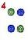  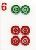 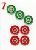  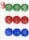

#### A.2.3 Bamboo (条)
- Notation: 1-9 with 'B' suffix (e.g., 1B, 2B)
- Complete set (1-9):
  
  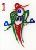 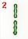 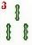 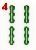 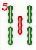 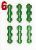 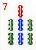 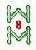 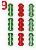

#### A.2.4 Honors
- Winds:
  - East (东): 
  - South (南): 
  - West (西): 
  - North (北): 

#### A.2.5 Flowers (花牌)
- Complete set:
  - Plum (梅): 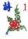
  - Orchid (兰): 
  - Bamboo (竹): 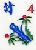
  - Chrysanthemum (菊): 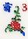

#### A.2.6 Special Tiles
- Dragons (三元牌):
  - White Dragon (白板): 
  - Red Dragon (红中): 
  - Green Dragon (发财): 

- **Concealed Tile** (暗牌): Represents a face-down tile
  

#### A.2.7 Tile Combinations
1. **Sequence** (顺子): Three consecutive tiles of the same suit
   - Example: , , 

2. **Triplet** (刻子): Three identical tiles
   - Example: , , 

3. **Pair** (对子): Two identical tiles
   - Example: , , 

### A.3 Advanced Flow Diagrams

#### A.3.1 State Value Calculation Flow
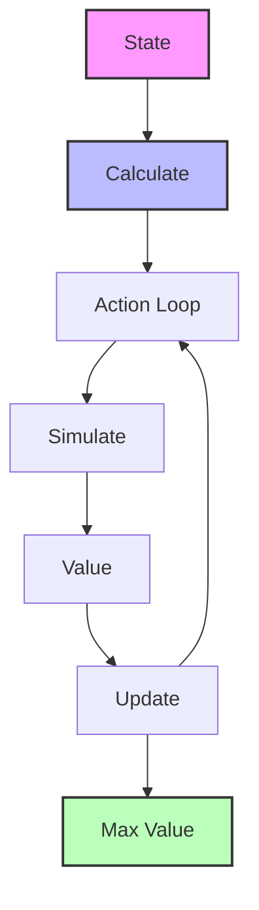

#### A.3.2 State Transition Example
```
Current Hand    Action(Discard 8 Characters)    New State(After Draw)
[1,1,1,8,8] -> [1,1,1,8]                    -> [1,1,1,8,?]
Rewards:
- Maintain sequence +1
- Break pair -1
- Ready hand opportunity +2
```

#### A.3.3 Value Iteration Process
1. Initialize V0(s) = 0 for all states
2. For each iteration k:
   Vk+1(s) = max_a[R(s,a) + γ * Σ P(s'|s,a)Vk(s')]
3. Continue until ||Vk+1 - Vk|| < ε

#### A.3.4 Strategy Optimization Flow
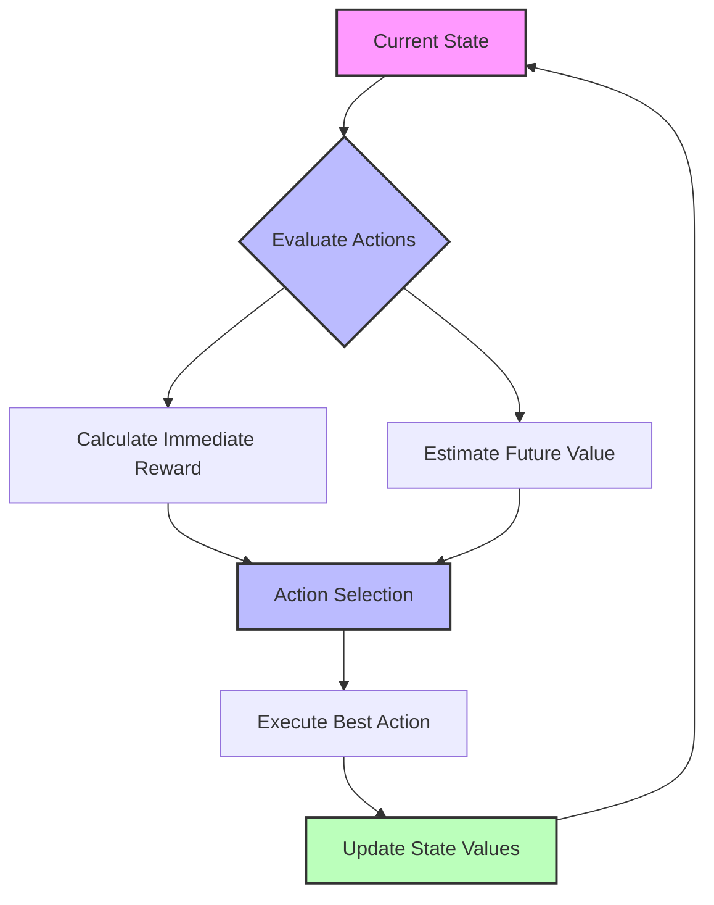

#### A.3.5 Balance Considerations
1. **Exploration vs Exploitation**
   - Try new strategies vs Use proven ones
   - Adaptive exploration rate
   - Temperature-based selection

2. **Risk vs Reward**
   - Safe play in leading position
   - Aggressive play when behind
   - Dynamic risk assessment

3. **Offensive vs Defensive**
   - Hand building speed
   - Defensive tile selection
   - Position-based strategy
</details>

