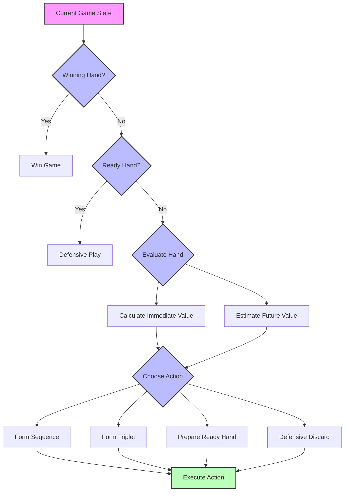
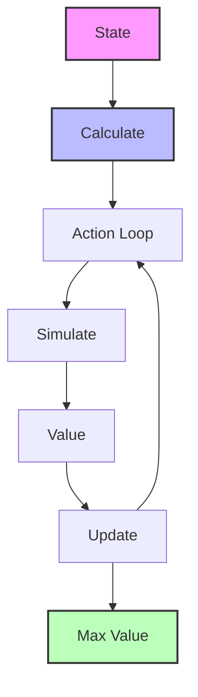

# Mahjong AI System Design Document

## 1. Project Overview

### 1.1 Project Goals
- Implement a Mahjong AI system based on Dynamic Programming
- Model Mahjong decision-making using Markov Decision Process (MDP)
- Optimize strategy selection using Bellman equation
- Support human-AI gameplay (0-4 human players)

### 1.2 Technology Stack
- Backend: Python
  * FastAPI (Web Framework)
  * NumPy (Vectorized Computation)
  * WebSocket (Real-time Communication)
- Performance Analysis:
  * line_profiler (Code Performance Analysis)
  * memory_profiler (Memory Usage Analysis)

### 1.3 Core Features
1. **Basic Game System**
   - Tile representation and management
   - Game state tracking
   - Rule validation (winning hands, ready hands)

2. **AI Decision System**
   - State evaluation
   - Action selection
   - Strategy optimization

3. **Performance Optimization**
   - State space compression
   - Computation result caching
   - Vectorized operations

## 2. Theoretical Foundation

### 2.1 MDP (Markov Decision Process)
In Mahjong, the five core elements of MDP are:
- **State (S)**: Current hand, visible tiles, remaining tile count
- **Action (A)**: Possible tile discards
- **Transition Probability (P)**: Probability distribution of next states after discarding
- **Reward (R)**: Formation of sequences, triplets, ready hands
- **Discount Factor (γ)**: Weight of future rewards

### 2.2 Bellman Equation Application
The Bellman equation for optimal strategy calculation:
```
V(s) = max[F(s,a) + γV(s')]
```
Where:
- V(s): Value of state s
- F(s,a): Immediate reward for action a
- γ: Discount factor
- V(s'): Value of next state

### 2.3 Dynamic Programming Methods
1. **State Value Calculation**:
   - Value iteration
   - Policy iteration
   - Monte Carlo simulation

2. **Strategy Optimization**:
   - Value-based action selection
   - Balance of immediate and long-term rewards
   - Exploration vs exploitation

## 3. System Flow Diagrams

**Flowchart Legend:**
- Pink nodes (🟪): Initial states
- Blue nodes (🟦): Processing steps and decision points
- Green nodes (🟩): Final results/actions

### 3.1 Basic Game Flow
```
[Game Start] -> [Deal] -> [Turn Start] -> [AI/Player Action] -> [Discard] -> [Win Check] -> [Turn End]
                                         ^                                                    |
                                         |____________________________________________________|
```

### 3.2 AI Decision Flow (Detailed Decision Tree)



### 3.3 State Value Calculation Flow



### 3.4 State Transition Example
```
Current Hand    Action(Discard 8 Characters)    New State(After Draw)
[1,1,1,8,8] -> [1,1,1,8]                    -> [1,1,1,8,?]
Rewards:
- Maintain sequence +1
- Break pair -1
- Ready hand opportunity +2
```

### 3.5 Tile Notation
- Characters (万): 1-9 with 'C' suffix (e.g., 1C, 2C)
- Circles/Dots (筒): 1-9 with 'D' suffix (e.g., 1D, 2D)
- Bamboo (条): 1-9 with 'B' suffix (e.g., 1B, 2B)
- Winds: East (E), South (S), West (W), North (N)
- Dragons: Red (R), Green (G), White (W)