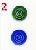

# Mahjong AI System Design Document

## 1. Project Overview

### 1.1 Project Goals
- Implement a simplified two-player Mahjong AI system
- Support open-hand gameplay (all tiles visible)
- Optimize strategy selection using heuristic methods
- Support human-AI gameplay

### 1.2 Technology Stack
- Backend: Python
  * FastAPI (Web Framework)
  * NumPy (Vectorized Computation)
  * WebSocket (Real-time Communication)
- Performance Analysis:
  * line_profiler (Code Performance Analysis)
  * memory_profiler (Memory Usage Analysis)

### 1.3 Core Features
1. **Basic Game System**
   - Tile representation and management
   - Game state tracking
   - Rule validation (winning hands)

2. **AI Decision System**
   - Hand evaluation
   - Action selection
   - Strategy optimization

3. **Performance Optimization**
   - State space compression
   - Computation result caching
   - Vectorized operations

## 2. Game Rules

### 2.1 Simplified Rules
1. **Basic Setup**
   - Two players
   - Open-hand gameplay (all tiles visible)
   - Simplified tile set (only one suit + honors)
   - 13 tiles per player

2. **Game Flow**
   - Players take turns drawing and discarding
   - Pung (triplet) allowed
   - No Chow (sequence) allowed
   - Win by self-draw or discard

3. **Winning Hands**
   - Basic winning pattern:
     * 4 sets (sequences/triplets) + 1 pair
     * 7 pairs
   - No complex scoring system

### 2.2 Tile Notation

#### Basic Suit (万)
- Notation: 1-9 with 'C' suffix (e.g., 1C, 2C)
- Complete set (1-9):
  
          

#### Honors
- Winds:
  - East (东): 
  - South (南): 
  - West (西): 
  - North (北): 

- Dragons:
  - White Dragon (白板): 
  - Red Dragon (红中): 
  - Green Dragon (发财): 

## 3. AI Implementation

### 3.1 Heuristic Approach
1. **Hand Evaluation**
   - Calculate distance to winning hand
   - Count potential sets (sequences/triplets)
   - Evaluate pair formation
   - Consider tile safety

2. **Decision Making**
   - Evaluate discard options
   - Consider opponent's potential moves
   - Balance offense and defense
   - Optimize for quick wins

### 3.2 Monte Carlo Tree Search (MCTS)
1. **Simulation Process**
   - Simulate future tile draws
   - Evaluate different discard strategies
   - Calculate win probabilities
   - Select optimal moves

2. **Optimization**
   - Parallel simulation
   - Early termination
   - State caching
   - Adaptive search depth

## 4. System Flow Diagrams

### 4.1 Basic Game Flow
```
[Game Start] -> [Deal] -> [Turn Start] -> [AI/Player Action] -> [Discard] -> [Win Check] -> [Turn End]
                                         ^                                                    |
                                         |____________________________________________________|
```

### 4.2 AI Decision Flow


## 5. Future Steps

### 5.1 Four-Player Mahjong
- Implement full four-player gameplay
- Add concealed tiles
- Support all meld types (Chow, Pung, Kong)
- Implement complex scoring system

### 5.2 Advanced AI Features
- Implement MDP-based decision making
- Add learning capabilities
- Support multiple AI difficulty levels
- Add tournament mode

### 5.3 Additional Features
- Online multiplayer support
- Tournament system
- Statistics and analytics
- Custom rule support

## Appendix A: Full Mahjong Rules and Theory

### A.1 Theoretical Foundation

#### A.1.1 MDP (Markov Decision Process)
The core challenge of Mahjong AI is to select optimal actions at each decision point based on the current state. MDP provides a mathematical framework to solve this sequential decision-making problem:

1. **Markov Property**: The next state depends only on the current state and action, independent of history
   - Example: Current hand + visible tiles contain all information needed for decision making
   
2. **State Transition**: Each action leads to state transitions with certain probabilities
   - Example: After discarding a tile, the next drawn tile is random
   
3. **Immediate Rewards**: Each state transition has an associated reward value
   - Example: Forming a sequence yields positive reward, breaking a potential set yields negative reward

#### A.1.2 State Space (S)
- **Hand State**: [t1, t2, ..., tn] where ti represents each tile
- **Visible Information**: 
  * Discarded tiles by all players
  * Exposed melds (Chi/Pon)
- **Game Progress**: 
  * Remaining tile count
  * Current round/wind

#### A.1.3 Action Space (A)
- **Discard Actions**: Choose one tile to discard
- **Meld Actions**:
  * Chi (Sequence formation)
  * Pon (Triplet formation)
- **Special Actions**:
  * Declare win
  * Skip (Pass on opponent's discard)

#### A.1.4 Bellman Equation and Dynamic Programming
[Previous content about Bellman Equation and Dynamic Programming methods]

### A.2 Complete Tile Notation

#### A.2.1 Characters (万)
- Notation: 1-9 with 'C' suffix (e.g., 1C, 2C)
- Complete set (1-9):
  
          

#### A.2.2 Circles/Dots (筒)
- Notation: 1-9 with 'D' suffix (e.g., 1D, 2D)
- Complete set (1-9):
  
          

#### A.2.3 Bamboo (条)
- Notation: 1-9 with 'B' suffix (e.g., 1B, 2B)
- Complete set (1-9):
  
          

#### A.2.4 Honors
- Winds:
  - East (东): 
  - South (南): 
  - West (西): 
  - North (北): 

#### A.2.5 Flowers (花牌)
- Complete set:
  - Plum (梅): 
  - Orchid (兰): 
  - Bamboo (竹): 
  - Chrysanthemum (菊): 

#### A.2.6 Special Tiles
- Dragons (三元牌):
  - White Dragon (白板): 
  - Red Dragon (红中): 
  - Green Dragon (发财): 

- **Concealed Tile** (暗牌): Represents a face-down tile
  

#### A.2.7 Tile Combinations
1. **Sequence** (顺子): Three consecutive tiles of the same suit
   - Example: , , 

2. **Triplet** (刻子): Three identical tiles
   - Example: , , 

3. **Pair** (对子): Two identical tiles
   - Example: , , 

### A.3 Advanced Flow Diagrams

#### A.3.1 State Value Calculation Flow
[Previous content about State Value Calculation Flow]

#### A.3.2 State Transition Example
[Previous content about State Transition Example]